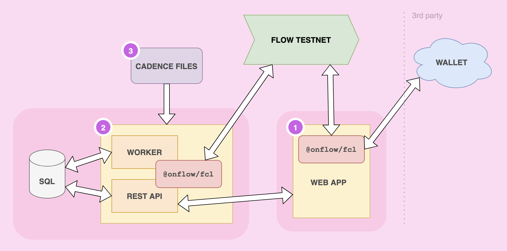

<p align="center">
    <a href="http://kitty-items-flow-testnet.herokuapp.com/">
        
    </a>
</p>

👋 Welcome! This demo app was created to help you learn how to build on Flow.

- Kitty Items is a **complete NFT marketplace** built with [Cadence](https://docs.onflow.org/cadence), Flow's resource-oriented smart contract programming language.
- Learn how to deploy contracts, mint NFTs, and integrate user wallets with the Flow Client Library (FCL).

## 🎬 Live Demo

Check out the [live demo of Kitty Items](http://kitty-items-flow-testnet.herokuapp.com/),
deployed on the Flow Testnet.

If you'd like to deploy your own version, see the [deploy to Heroku](#optional-heroku-deployment) instructions near the bottom to this setup guide.

## ✨ Getting Started
### 1. Install the Flow CLI

Before you start, install the [Flow command-line interface (CLI)](https://docs.onflow.org/flow-cli).

_⚠️ This project requires `flow-cli v0.15.0` or above._

### 2. Clone the project

```sh
git clone https://github.com/onflow/kitty-items.git
```
### 3. Install dependencies


- Run `npm install` in the root of the project.
- Run `npx lerna exec npm install` to install project dependencies.

### 4. Start the project

## Local development


1)  Run `npm run start:dev` 
    - Local development uses the [Flow Emulator](https://docs.onflow.org/emulator/) and the [FCL Development Wallet](https://github.com/onflow/fcl-dev-wallet) to simulate the blockchain and an FCL-compatible wallet.

2)  Run `flow project deploy --network emulator`
    - All contracts are deployed to the emulator.


## Testnet development
### Create a Flow Testnet account 

You'll need a Testnet account to work on this project. Here's how to make one:

#### Generate a key pair 

Generate a new key pair with the Flow CLI:

```sh
flow keys generate
```

_⚠️ Make sure to save these keys in a safe place, you'll need them later._

#### Create your account

Go to the [Flow Testnet Faucet](https://testnet-faucet-v2.onflow.org/) to create a new account. Use the **public key** from the previous step.

#### Save your keys

After your account has been created, export the following environment variables to your shell:

```sh
# Replace these values with the address returned from the faucet and the
# private key you generated in the first step!

export FLOW_ADDRESS=address
export FLOW_PRIVATE_KEY=xxxxxxxxxxxx
```

_⚠️ Note: It's important that these variables are exported in each shell where you're running any of the commands in this walkthrough._

1)  Run: `npm run start:testnet`
    - Testnet development will connect the application to Flow's testnet
  
2) Run: `flow project deploy --network testnet -f flow.json -f flow.testnet.json`
   - All contracts are deployed to the Flow testnet.

---
### (Optional) Heroku Deployment

If you'd like to deploy a version of this app to Heroku for testing, you can use this button!

[](https://heroku.com/deploy)

You'll need to supply the following configuration variables when prompted: 

```bash
# The Flow address and private key you generated above

MINTER_ADDRESS
MINTER_PRIVATE_KEY

# The Flow address where you have deployed your Kitty Items contract.
# (usually the same Flow address as above)

REACT_APP_CONTRACT_KIBBLE
REACT_APP_CONTRACT_KITTY_ITEMS
REACT_APP_CONTRACT_KITTY_ITEMS_MARKET
```

## Project Overview



## 🔎 Legend

Above is a basic diagram of the parts of this project contained in each folder, and how each part interacts with the others.

### 1. Web App (Static website) | [kitty-items/web](https://github.com/onflow/kitty-items/tree/master/web)

A true dapp, client-only web app. This is a complete web application built with React that demonstrates how to build a static website that can be deployed to an environment like IPFS and connects directly to the Flow blockchain using `@onflow/fcl`. No servers required. `@onflow/fcl` handles authentication and authorization of [Flow accounts](https://docs.onflow.org/concepts/accounts-and-keys/), [signing transactions](https://docs.onflow.org/concepts/transaction-signing/), and querying data using using Cadence scripts.

### 2. Look Ma, a Web Server! | [kitty-items/api](https://github.com/onflow/kitty-items/tree/master/api)

We love decentralization, but servers are still very useful, and this one's no exception. The code in this project demonstrates how to connect to Flow using [Flow JavaScript SDK](https://github.com/onflow/flow-js-sdk) from a Node JS backend. It's also chalk-full of handy patterns you'll probably want to use for more complex and feature-rich blockchain applications, like storing and querying events using a SQL database (Postgres). The API demonstrates how to send transactions to the Flow Blockchain, specifically for minting [Kibbles](https://github.com/onflow/kitty-items/blob/master/cadence/contracts/Kibble.cdc) (fungible tokens) and [Kitty Items](https://github.com/onflow/kitty-items/blob/master/cadence/contracts/KittyItems.cdc) (non-fungible tokens).

### 3. Cadence Code | [kitty-items/cadence](https://github.com/onflow/kitty-items/tree/master/cadence)

[Cadence](https://docs.onflow.org/cadence) smart contracts, scripts & transactions for your viewing pleasure. This folder contains all of the blockchain logic for the marketplace application. Here you will find examples of [fungible token](https://github.com/onflow/flow-ft) and [non-fungible token (NFT)](https://github.com/onflow/flow-nft) smart contract implementations, as well as the scripts and transactions that interact with them. It also contains examples of how to _test_ your Cadence code (tests written in Golang).

## 😺 What are Kitty Items?

Items are hats for your cats, but under the hood they're [non-fungible tokens (NFTs)](https://github.com/onflow/flow-nft) stored on the Flow blockchain.

Items can be purchased from the marketplace with fungible tokens.
In the future you'll be able to add them to [Ethereum CryptoKitties](https://www.cryptokitties.co/) with ownership validated by an oracle.

## ❓ More Questions?

- Chat with the team on the [Flow Discord server](https://discord.gg/xUdZxs82Rz)
- Ask questions on the [Flow community forum](https://forum.onflow.org/t/kitty-items-marketplace-demo-dapp/759/5)

---

🚀 Happy Hacking!
